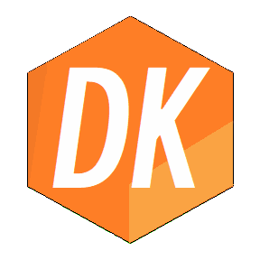

<h1>DanKeTools</h1>

<h5>小而美、可扩展、插件式、高内聚低耦合的游戏基础开发库</h5>

  

#### DanKeTools的好处有哪些？

- ### 简洁至上

  代码精简，可读性强，高内聚低耦合。

- ### 功能强大

  涵盖了许多常见游戏开发中的代码，让程序员可以专心于实现游戏中的逻辑关系。

- ### 可移植性

  使用纯C#语言编写，无需担心平台不兼容，甚至可以移植到其他游戏引擎。
